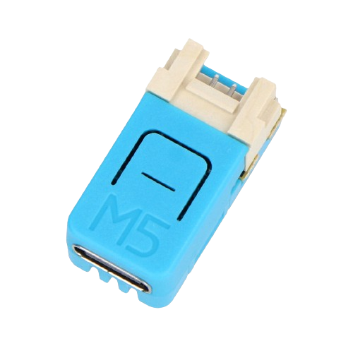

<!-- PROJECT LOGO -->
<br />
<p align="center">
  <a href="https://github.com/dj1ch/esp32c6-sniffer">
    
  </a>

  <h3 align="center">esp32c6-sniffer</h3>

  <p align="center">
    A proof of concept ESP32C6 sniffer.
    <br />
    <a href="https://github.com/dj1ch/esp32c6-sniffer"><strong>Explore the docs »</strong></a>
    <br />
    <br />
    <a href="https://github.com/dj1ch/esp32c6-sniffer">View Demo</a>
    ·
    <a href="https://github.com/dj1ch/esp32c6-sniffer/issues">Report Bug</a>
    ·
    <a href="https://github.com/dj1ch/esp32c6-sniffer/issues">Request Feature</a>
  </p>
</p>


<!-- TABLE OF CONTENTS -->
## Table of Contents

* [About the Project](#about-the-project)
  * [Built With](#built-with)
* [Getting Started](#getting-started)
  * [Prerequisites](#prerequisites)
  * [Installation](#installation)
* [Usage](#usage)
* [Roadmap](#roadmap)
* [Contributing](#contributing)
* [License](#license)
* [Contact](#contact)
* [Acknowledgements](#acknowledgements)

<!-- ABOUT THE PROJECT -->
## About The Project

This POC (Proof of concept) tool showcases an ESP32C6 with the ESP-IDF framework, to be a WiFi sniffer with the capabilities of looking for user-specified settings. I don't intend for this to be anymore than a miniature version of Wireshark.

As of now, the firmware is very minimal and is only capable of sniffing for packets on a randomly generated channel. Everything else from the CLI to the user-defined settings are still a work in progress.

Originally, this was meant to be firmware for the M5NanoC6, but it is likely that this can compile on other ESP32 boards.

**As a developer, I do not endorse the illegal use of this firmware. Any sort of trouble you get into I am not responsible for!!!**


### Built With

* [esp-idf@v5.3](https://github.com/espressif/esp-idf/tree/v5.3)
* [M5NanoC6](https://shop.m5stack.com/products/m5stack-nanoc6-dev-kit) or any other ESP32

<!-- GETTING STARTED -->
## Getting Started

To get a local copy up and running follow these simple steps.

### Prerequisites

### Installation

1. Clone the repo

```sh
git clone https://github.com/dj1ch/esp32c6-sniffer.git
```

2. Install `esp-idf`: Follow [documentation](https://docs.espressif.com/projects/esp-idf/en/latest/esp32/get-started/#installation) and install version 5.3.

3. Set board target

```sh
idf.py set-target esp32
```

4. Build the project

```sh
idf.py build
```

5. Flash to your ESP32(replace `PORT` with the port connected to your ESP32)

```sh
idf.py -p PORT flash
```

or you can run

```sh
idf.py flash
```

<!-- USAGE EXAMPLES -->
## Usage

TBA

<!-- ROADMAP -->
## Roadmap

As of now I would like to implement/am in the progress of implementing:

* Mac address searching/filtering.
* Filtering for specific types of packets.
* CLI tools that allow things such as channel switching, stopping processes, etc.
* Additional control over LEDS such as RGB LEDS.
* Additional user configuration.

See the [open issues](https://github.com/dj1ch/esp32c6-sniffer/issues) for a list of proposed features (and known issues).

<!-- CONTRIBUTING -->
## Contributing

Contributions are what make the open source community such an amazing place to be learn, inspire, and create. Any contributions you make are **greatly appreciated**.

1. Fork the Project
2. Create your Feature Branch (`git checkout -b feature/AmazingFeature`)
3. Commit your Changes (`git commit -m 'Add some AmazingFeature'`)
4. Push to the Branch (`git push origin feature/AmazingFeature`)
5. Open a Pull Request

<!-- LICENSE -->
## License

Distributed under the MIT License. See `LICENSE` for more information.

<!-- CONTACT -->
## Contact

dj1ch - tg.1ch0712@gmail.com

Project Link: [https://github.com/dj1ch/esp32c6-sniffer](https://github.com/dj1ch/esp32c6-sniffer)

<!-- ACKNOWLEDGEMENTS -->
## Acknowledgements

* [Espressif](https://github.com/espressif/)
* [ESP32 Wifi Sniffing example](https://github.com/lpodkalicki/blog/blob/master/esp32/016_wifi_sniffer/main/main.c)
* [ESP32 Advanced Console example](https://github.com/espressif/esp-idf/tree/v5.3/examples/system/console/advanced)
* And many more...!
